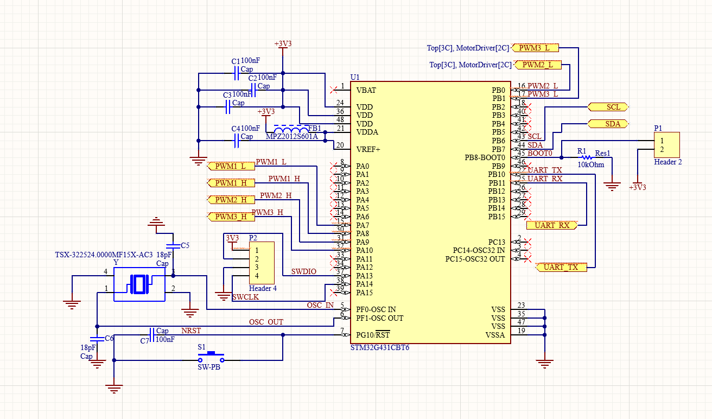

A comprehensive, system-level embedded engineering project featuring a **custom multi-layer PCB designed in Altium Designer**, direct **register-level (CMSIS/Bare-metal) STM32 C firmware**, and **MATLAB/Simulink** dynamic system modeling for a 3-axis brushless drone gimbal stabilization system.

---

Hardware Architecture & Circuit Design (Altium Designer)

The custom control board was developed on a compact **75 mm x 75 mm** 4-layer PCB form factor. The hardware design is strictly modularized into isolated circuit blocks to guarantee signal integrity and power stability.

### 1. Functional Schematic Blocks

Microcontroller & Clock Subsystem
* **Core MCU:** **STM32G431CBT6** (ARM Cortex-M4 with FPU, 170 MHz max frequency, 128 KB Flash, 32 KB SRAM).
* **Power Decoupling:** Array of 100nF and 4.7µF ceramic capacitors placed in close proximity to every $V_{DD}/V_{SS}$ pin pair to suppress high-frequency voltage noise.
* **Clock Generation:** 8 MHz High-Speed External (HSE) crystal oscillator circuit with tuned load capacitors ($C_L = 20\text{ pF}$) for ultra-stable PLL clock generation.
* **Debug Interface:** SWD (Serial Wire Debug) header exposing `SWDIO` and `SWCLK` pins for low-level debugging and flashing.

Power Management & Voltage Regulation
* **Primary Supply:** Accepts a 2S–3S LiPo battery input ($7.4\text{V} - 11.1\text{V}$).
* **Logic Power Rail:** Low-dropout regulator (LDO) stepping down main power supply to a clean 3.3V system logic level.
* **Noise Suppression:** Bulk electrolytic input capacitors combined with LC low-pass output filters to prevent switching ripples from propagating into the digital plane.

Motor Driver & IMU Sensor Interface
* **Triple Half-Bridge Driver:** **TI DRV8313** 3-Phase PWM motor driver configured with dedicated current limiters and undervoltage lockout (UVLO) protections.
* **Inertial Measurement Unit (IMU):** **MPU-6050** 6-DOF Gyroscope and Accelerometer connected via a dedicated high-speed I2C bus ($400\text{ kHz}$) with external $4.7\text{ k}\Omega$ pull-up resistors on `SCL` and `SDA` lines.

---

PCB Layer Stackup Strategy & EMI/EMC Design Rationale

Why is this board implemented using a **Multi-Layer Stackup** instead of a standard 2-layer design?

BLDC motor drivers switch high currents at high frequencies ($10-20\text{ kHz}$ PWM), generating intense Electromagnetic Interference (EMI). Without a multi-layer design strategy, this switching noise severely degrades IMU sensor readouts and induces voltage drops (IR drops) that reset the MCU.

Engineering Justifications for Multi-Layer Routing:

1. **Signal Integrity & Noise Isolation (EMI/EMC Shielding):**
   * **Top Layer:** Dedicated to high-speed digital signals and sensitive analog lines (I2C bus, HSE crystal trace).
   * **Inner Layer 1 (GND Plane):** Unbroken solid copper ground plane acting as a Faraday cage. It shields sensitive sensor lines from high-frequency PWM switching noise emitted by the DRV8313 driver traces below.
   * **Inner Layer 2 (Power Plane):** Low-impedance power distribution plane ensuring instantaneous current supply to the DRV8313 without triggering MCU undervoltage reset events.
   * **Bottom Layer:** High-current PWM traces feeding the BLDC motor phases.

2. **Thermal Management & Dissipation:**
   * Thermal vias placed directly under the DRV8313 power pad transfer heat into internal copper planes. This distributes thermal energy across the 75x75 mm PCB and prevents driver thermal shutdown without requiring heavy external heatsinks.

3. **Controlled Impedance & Compact Footprint:**
   * Multi-layer via transitions allow routing 3-phase motor outputs, MCU signals, power regulators, and sensor headers on a single 75 mm x 75 mm board while maintaining signal trace orthogonality to minimize cross-talk.

---

 Firmware Architecture (Bare-Metal C)

The control firmware is built entirely in **bare-metal C using CMSIS register access**, avoiding HAL library overhead to achieve deterministic microsecond execution times.

 CMSIS Register Implementations & Modules:
 * Timer 1 Center-Aligned 3-Phase SPWM (TIM1):
   * Configured in Center-Aligned Mode 1 to minimize total harmonic distortion (THD) on motor phases.
   * Direct register manipulation (TIM1->CCR1, TIM1->CCR2, TIM1->CCR3) updates 3-phase sinusoidal duty cycles in real time.
 * I2C Bare-Metal Communication (I2C1):
   * Direct register polling of I2C1->ISR and I2C1->TXDR/RXDR for zero-latency burst reading of raw accelerometer and gyroscope data from MPU-6050.
 * Complementary Filter Algorithm:
   * Combines high-pass filtered gyro rates with low-pass filtered accelerometer tilt angles to calculate drift-free tilt angles:
     
 * Discrete PID Control Loop (100 Hz):
   * Computes proportional, integral, and derivative corrections based on orientation error (\text{Error} = \theta_{target} - \theta_{est}) every dt = 10\text{ ms}:
     
Firmware Footprint Analysis:
 * FLASH Memory: ~1.58 KB / 128 KB (1.21% utilization)
 * SRAM Memory: ~1.97 KB / 32 KB (6.03% utilization)
MATLAB & Simulink Dynamic Simulation
To validate PID tuning constants (K_p, K_i, K_d) and filter parameters (\alpha) before flashing physical hardware, the electro-mechanical system was modeled in MATLAB.
 * Transfer Function Modeling: Evaluated time-domain step responses using the gimbal frame's physical moment of inertia (J) and mechanical damping (b):
   
 * Sensor Noise Injection: Injected Gaussian white noise into simulated MPU-6050 accelerometer outputs to measure Complementary Filter phase lag and attenuation efficacy.

